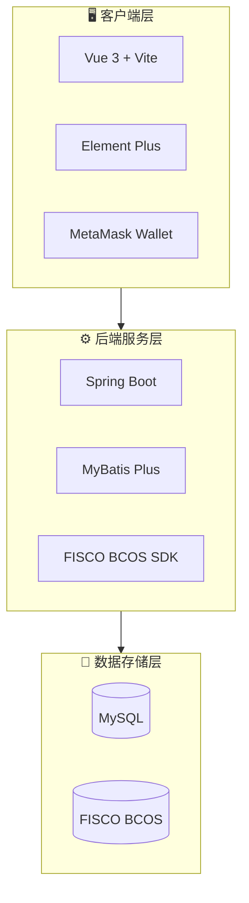
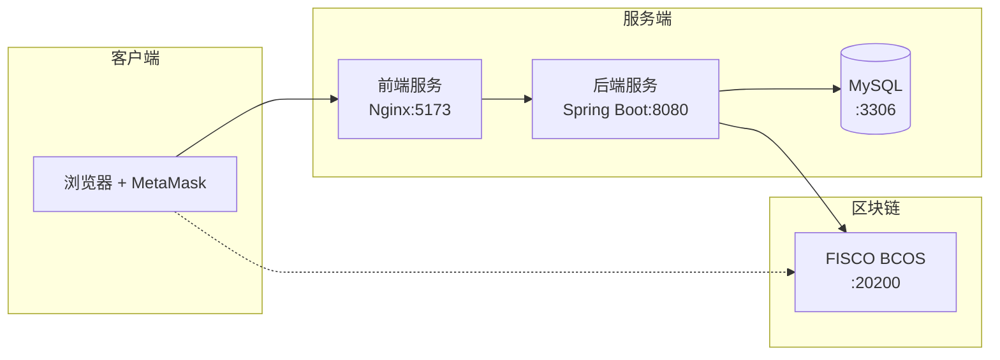
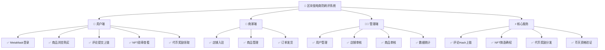

# 区块链电商防刷评系统 - 项目过程与结果

> 本文档详细描述项目的开发过程与最终成果

---

## 2、项目过程

### 2.1 需求分析阶段

#### 2.1.1 行业痛点调研

通过深入调研电商行业现状，明确了以下核心问题：

| 问题类别 | 具体表现 | 影响程度 |
|---------|---------|---------|
| 虚假评论泛滥 | 约30%-40%的网购评论存在虚假成分 | ⭐⭐⭐⭐⭐ |
| 消费者信任危机 | 超过65%消费者曾因虚假评论做出错误决策 | ⭐⭐⭐⭐⭐ |
| 评论可篡改 | 中心化存储导致评论可被修改或删除 | ⭐⭐⭐⭐ |
| 激励机制缺失 | 优质评论者缺乏有效激励 | ⭐⭐⭐ |

#### 2.1.2 需求规格确定

根据调研结果，确定系统需实现以下核心需求：

**功能需求**
- 用户认证（MetaMask钱包）
- 商品浏览与购买
- 评论提交与存证
- NFT铸造与确权
- 代币奖励发放
- 币天验证机制
- 管理后台功能

**非功能需求**
- 评论数据不可篡改
- 系统高可用性
- 响应时间 < 3秒
- 支持高并发访问
- 数据安全性保障

---

### 2.2 系统设计阶段

#### 2.2.1 总体架构设计

采用前后端分离的三层架构，结合区块链技术：



#### 2.2.2 技术选型

| 层级 | 技术选型 | 选型理由 |
|:---:|:---|:---|
| **前端** | Vue 3 + Vite + Element Plus | 响应式框架，开发效率高，生态完善 |
| **后端** | Java 17 + Spring Boot + MyBatis Plus | 企业级框架，稳定可靠，易于维护 |
| **数据库** | MySQL | 成熟的关系型数据库，支持事务处理 |
| **区块链** | FISCO BCOS | 国产开源联盟链，性能优越，合规安全 |
| **智能合约** | Solidity 0.6.10 | 以太坊智能合约语言，生态丰富 |
| **钱包** | MetaMask | Web3主流钱包，用户基数大 |

#### 2.2.3 数据库设计

设计了四张核心业务表：

**Users（用户表）**
- id, wallet_addr, role, nickname, shop_name, shop_status ...

**Products（商品表）**
- id, merchant_id, name, price, stock, status ...

**Orders（订单表）**
- id, user_id, product_id, quantity, status, is_reviewed ...

**Reviews（评论表）**
- id, user_id, product_id, content, rating, nft_id, tx_hash ...

> 表关系：Users ← Products (merchant_id)，Orders → Reviews (user_id, product_id)

#### 2.2.4 智能合约设计

设计并实现了6个核心智能合约：

| 合约名称 | 功能描述 |
|---------|---------|
| **ReviewCore.sol** | 评论核心逻辑，记录评论Hash，关联用户和商品 |
| **ReviewNFT.sol** | ERC721标准，将评论铸造为唯一NFT |
| **RewardPool.sol** | 奖励池合约，管理代币奖励分发 |
| **CoinDayValidator.sol** | 币天验证器，防止批量刷评攻击 |
| **AccessControl.sol** | 权限管理合约，控制访问权限 |
| **TestToken.sol** | 测试代币合约，用于奖励发放 |

---

### 2.3 编码开发阶段

#### 2.3.1 后端开发

**控制器层 (Controller)**
```
├── AuthController.java       # 用户认证
├── UsersController.java      # 用户管理
├── ProductsController.java   # 商品管理
├── OrdersController.java     # 订单管理
├── ReviewsController.java    # 评论管理（核心）
├── AdminController.java      # 管理后台
└── FileController.java       # 文件上传
```

**服务层 (Service)**
- 业务服务：IUsersService、IProductsService、IOrdersService、IReviewsService
- 区块链服务：ReviewCoreService、ReviewNFTService、RewardPoolService、CoinDayValidatorService

#### 2.3.2 前端开发

**页面模块**
```
├── Login.vue          # MetaMask登录
├── Home.vue           # 商城首页
├── ProductDetail.vue  # 商品详情
├── Checkout.vue       # 确认订单
├── Review.vue         # 发布评价
├── Transactions.vue   # 交易记录
├── Rewards.vue        # 我的奖励
├── Account.vue        # 个人账户
├── admin/             # 管理后台
└── merchant/          # 商家后台
```

**核心组件**
- WalletConnectBtn.vue：钱包连接按钮
- NavBar.vue：导航栏组件
- ProductCard.vue：商品卡片组件
- NftTip.vue：NFT提示组件

#### 2.3.3 智能合约开发

以 ReviewCore.sol 为例的核心逻辑：

```solidity
function submitReview(
    string memory productId,
    string memory content,
    uint8 rating
) external returns (uint256) {
    // 1. 验证评论内容长度和评分
    require(bytes(content).length >= minContentLength, "Content too short");
    require(rating >= 1 && rating <= 5, "Invalid rating");
    
    // 2. 验证用户币天资格
    require(validator.validateCoinDays(msg.sender), "Insufficient coin days");
    
    // 3. 计算并发放奖励
    uint256 reward = rewardPool.calculateReward(coinDays, contentLength, rating);
    rewardPool.distributeReward(msg.sender, reward, reviewId);
    
    // 4. 铸造NFT确权
    uint256 nftId = reviewNFT.mint(msg.sender, reviewId, productId);
    
    // 5. 保存评论到链上
    reviews[reviewId] = Review({...});
}
```

---

### 2.4 测试与集成阶段

#### 2.4.1 测试策略

| 测试类型 | 测试内容 | 测试工具 |
|---------|---------|---------|
| 单元测试 | Service层业务逻辑 | JUnit 5 + Mockito |
| 接口测试 | RESTful API | Postman |
| 合约测试 | 智能合约功能 | FISCO BCOS Console |
| 集成测试 | 前后端联调 | 手工测试 |
| 链上测试 | 区块链交互 | Sepolia测试网 |

#### 2.4.2 核心功能测试用例

**评论提交流程测试**

| 步骤 | 操作 | 预期结果 |
|------|------|----------|
| 1 | 用户通过MetaMask登录 | 成功获取钱包地址，完成身份认证 |
| 2 | 用户浏览商品并下单购买 | 订单创建成功，状态为待支付 |
| 3 | 用户完成支付并确认收货 | 订单状态更新为已收货 |
| 4 | 用户填写评价内容并提交 | 评论保存成功，生成NFT ID |
| 5 | 系统异步上链 | 评论Hash写入区块链，返回交易哈希 |
| 6 | 用户查看奖励 | 代币奖励到账，NFT勋章可见 |

---

### 2.5 部署与上线阶段

#### 2.5.1 部署架构



#### 2.5.2 环境配置

| 环境 | 配置说明 |
|------|---------|
| JDK | Java 17 |
| Node.js | >= 20.19.0 |
| MySQL | 8.0+ |
| FISCO BCOS | 2.x 版本 |
| 区块链网络 | Sepolia 测试网 |

---

## 3、项目结果

### 3.1 功能实现成果

#### 3.1.1 系统功能总览



#### 3.1.2 核心功能完成情况

| 功能模块 | 完成状态 | 功能描述 |
|---------|:------:|---------|
| **MetaMask钱包登录** | ✅ 完成 | 支持通过MetaMask钱包进行身份认证，实现去中心化登录 |
| **商品浏览与搜索** | ✅ 完成 | 支持商品列表展示、关键词搜索、分类筛选 |
| **订单创建与支付** | ✅ 完成 | 支持创建订单、模拟支付、确认收货完整流程 |
| **评论提交与上链** | ✅ 完成 | 评论内容保存至数据库，Hash值异步上链存证 |
| **NFT铸造确权** | ✅ 完成 | 每条评论铸造为唯一NFT，确立数字版权 |
| **代币奖励机制** | ✅ 完成 | 根据评论质量计算奖励，自动发放代币 |
| **币天验证机制** | ✅ 完成 | 验证用户持币时间，防止批量刷评攻击 |
| **商家店铺管理** | ✅ 完成 | 店铺入驻申请、信息管理、商品发布 |
| **管理后台** | ✅ 完成 | 用户管理、店铺审核、商品审核、数据统计 |

---

### 3.2 技术成果

#### 3.2.1 代码统计

| 模块 | 文件数量 | 主要语言 |
|------|:------:|---------|
| 后端服务 | 30+ | Java |
| 前端应用 | 25+ | Vue.js |
| 智能合约 | 6 | Solidity |
| 配置文件 | 10+ | XML/Properties |

#### 3.2.2 API接口清单

| 模块 | 端点 | 接口数量 |
|------|------|:------:|
| 认证模块 | `/api/auth` | 3 |
| 用户模块 | `/api/users` | 5 |
| 商品模块 | `/api/products` | 8 |
| 订单模块 | `/api/orders` | 6 |
| 评论模块 | `/api/reviews` | 7 |
| 管理模块 | `/api/admin` | 10+ |
| 商家模块 | `/api/merchant` | 8 |

#### 3.2.3 智能合约功能

| 合约 | 核心函数 | 功能说明 |
|------|---------|---------|
| ReviewCore | `submitReview()` | 提交评论并触发NFT铸造和奖励发放 |
| ReviewNFT | `mint()` | 铸造评论NFT，返回唯一NFT ID |
| RewardPool | `distributeReward()` | 计算并发放代币奖励 |
| CoinDayValidator | `validateCoinDays()` | 验证用户是否满足币天要求 |
| AccessControl | `checkPermission()` | 权限验证 |

---

### 3.3 创新成果

#### 3.3.1 技术创新点

| 创新点 | 技术实现 | 解决的问题 |
|--------|---------|-----------|
| **评论上链存证** | 评论Hash值写入FISCO BCOS区块链 | 防止评论被恶意篡改或删除 |
| **NFT数字确权** | 基于ERC721标准铸造评论NFT | 明确评论归属权，实现数字资产化 |
| **代币激励模型** | 智能合约自动计算和发放奖励 | 激励用户发布真实高质量评论 |
| **币天防刷机制** | CoinDayValidator验证持币时间 | 有效防止批量注册刷评攻击 |
| **Web3身份认证** | MetaMask钱包签名登录 | 去中心化身份验证，保护用户隐私 |

#### 3.3.2 与传统方案对比

| 维度 | 传统电商方案 | 本系统方案 | 优势 |
|------|------------|-----------|------|
| 数据存储 | 中心化数据库 | 区块链+数据库双存储 | 数据不可篡改 |
| 身份认证 | 手机号/账号 | 钱包地址+币天验证 | 提高刷评成本 |
| 激励机制 | 积分/优惠券 | 代币+NFT | 具有真实价值 |
| 透明度 | 平台内部规则 | 智能合约公开 | 规则透明可验证 |
| 评论确权 | 无 | NFT数字确权 | 明确知识产权 |

---

### 3.4 项目成果总结

#### 3.4.1 目标达成情况

| 项目目标 | 达成状态 | 说明 |
|---------|:------:|------|
| 实现评论上链存证 | ✅ 达成 | 评论Hash成功写入FISCO BCOS区块链 |
| 实现NFT确权机制 | ✅ 达成 | 每条评论铸造为唯一NFT |
| 实现代币激励 | ✅ 达成 | 智能合约自动计算并发放奖励 |
| 实现币天防刷 | ✅ 达成 | CoinDayValidator有效验证用户资格 |
| 完成前后端开发 | ✅ 达成 | Vue 3前端 + Spring Boot后端 |
| 完成智能合约开发 | ✅ 达成 | 6个智能合约全部完成部署 |

#### 3.4.2 系统价值

**对消费者**
- ✅ 获得真实可信的评论参考，减少购买决策失误
- ✅ 评论权益通过NFT确权保护
- ✅ 优质评论可获得代币奖励

**对商家**
- ✅ 真实评论有助于提升品牌公信力
- ✅ 遏制恶意刷评竞争，建立公平环境
- ✅ 高质量评论有助于产品改进

**对平台**
- ✅ 提升评论系统整体可信度
- ✅ 降低人工审核成本
- ✅ 响应国家监管合规要求

**对行业**
- ✅ 探索区块链赋能电商的新模式
- ✅ 推动行业诚信体系建设
- ✅ 为Web3与实体经济融合提供实践案例

---

### 3.5 项目展望

| 发展方向 | 规划内容 |
|---------|---------|
| **技术升级** | 引入零知识证明提升隐私保护，优化智能合约Gas消耗 |
| **功能扩展** | 增加评论投票权重、信用评分系统 |
| **生态建设** | 对接更多电商平台，扩大应用覆盖面 |
| **激励优化** | 完善代币经济模型，引入质押挖矿机制 |
| **AI融合** | 结合AI进行评论质量评估，与区块链存证形成互补 |

---

> **结语**：本项目成功实现了基于区块链技术的电商防刷评系统，通过评论上链存证、NFT确权、代币激励等创新机制，为解决电商平台虚假评论问题提供了切实可行的技术方案。项目展示了区块链技术在实体经济中的应用价值，为构建更加真实、透明、可信的电商评论生态奠定了基础。

---

*文档生成日期：2026年1月2日*
